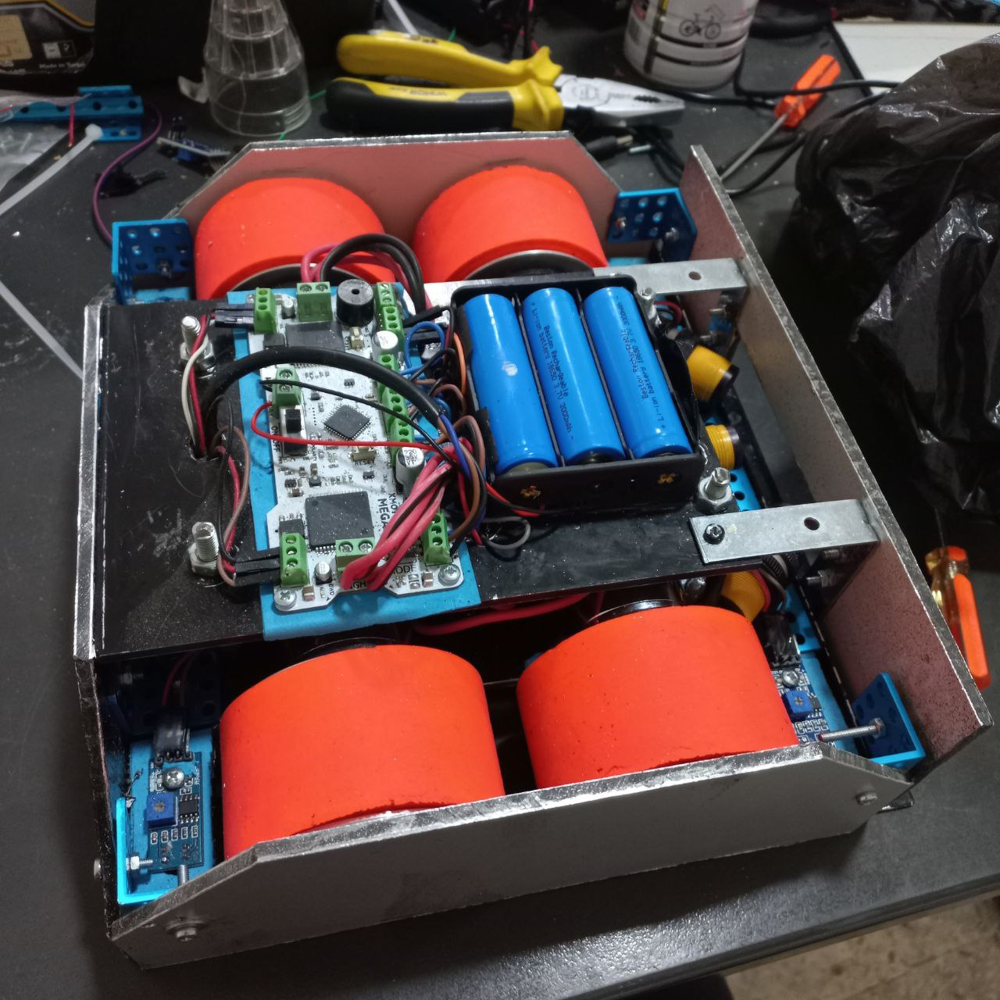

# ARC-8 Sumo Robot Competition

This repository contains Arduino code for a Sumo Robot designed to compete in the ARC-8 Sumo Robot Competition. The robot is equipped with multiple sensors for line detection and opponent detection, and uses the XMotion library for motor control.

## Project Overview

The Sumo Robot is an autonomous robot designed to compete in a sumo wrestling-style competition. The robot must:

- Stay within a circular ring (detected by line sensors)
- Detect and locate opponents using obstacle sensors
- Attack opponents while maintaining its position within the ring
- Avoid falling out of the ring boundaries

## Images

### Robot Image

### Competition Images

### Competition Victory

## Hardware Components

### Sensors

- **4 Line Sensors**: Front Right (FR), Front Left (FL), Back Right (BR), Back Left (BL) - detect ring boundaries
- **5 Obstacle Sensors**: Left, Left Diagonal, Middle, Right Diagonal, Right - detect opponents

### Additional Components

- XMotion Motor Controller
- DIP Switches (3 switches)
- Start Button (D10)
- LED Indicators

## Code Files

### `Prototype_Sumo_Robot.ino`

Main implementation with ring boundary detection, opponent detection, attack strategies, and star search pattern.

### `Xmotion_code.ino`

Advanced implementation with 5 opponent sensors, arc turning, memory system, and DIP switch configuration.

### `prototypecode.ino`

Simple prototype code for basic testing.

## Installation & Setup

1. Install the XMotion library in Arduino IDE
2. Configure pin assignments in the `.ino` files (note: `Prototype_Sumo_Robot.ino` has placeholder pins)
3. Upload code to your Arduino board
4. Calibrate sensors and adjust movement speeds as needed

## Attack and Search Strategies

The robot uses a multi-sensor approach to determine the best attack angle:

- **Single Left Sensor**: Turns right to face opponent
- **Left + Middle Sensors**: Turns left to center on opponent
- **All Three Sensors**: Moves forward aggressively (opponent centered)
- **Single Right Sensor**: Turns right to face opponent
- **Right + Middle Sensors**: Turns right to center on opponent

This strategy ensures the robot positions itself optimally before engaging, maximizing pushing power when the opponent is directly ahead.

When no opponent is detected, the robot performs a **star search pattern**:

- Moves forward a set distance
- Turns 144 degrees (one-fifth of 360°)
- Repeats 5 times to complete a full star pattern
- Continues until opponent is detected

This systematic approach ensures comprehensive coverage of the ring area and prevents the robot from getting stuck in corners.

**Note**: Test the robot thoroughly before competition and adjust parameters based on your hardware configuration.
